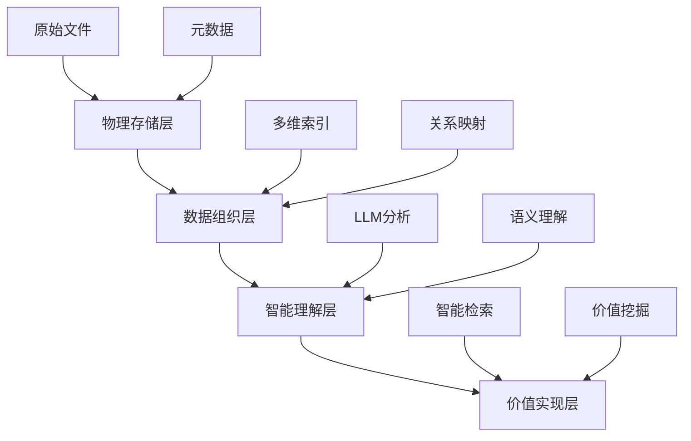
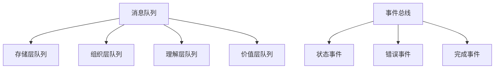

# 智能照片管理系统实施路线图

## 一、项目概述

### 1.1 设计理念
基于第一性原理的照片管理系统，实现从物理存储到价值实现的完整解决方案。

### 1.2 系统架构


## 二、实施阶段

### 2.1 第一阶段：基础架构建设（1-2周）

#### 2.1.1 存储系统搭建
```
OneDrive/
├── Original/
│   ├── Cameras/
│   │   ├── [相机型号]/
│   │   │   ├── RAW/
│   │   │   ├── JPEG/
│   │   │   └── Projects/
│   ├── Phones/
│   └── Others/
└── Virtual_Collections/
    ├── By_Date/
    ├── By_Location/
    ├── By_People/
    ├── By_Event/
    └── By_Tags/
```

#### 2.1.2 基础工具部署
- rclone 配置与 OneDrive 连接
- ExifTool 安装与配置
- 数据库初始化
- 依赖包安装

#### 2.1.3 元数据管理
- 文件命名规范：`[设备]_[日期]_[序号]_[标签].[格式]`
- EXIF 数据提取流程
- 元数据索引设计
- 数据库架构实现

### 2.2 第二阶段：智能化实现（2-3周）

#### 2.2.1 LLM 服务集成
- LLM 客户端配置
- 图像分析服务部署
- 语义理解模块开发
- 智能标签系统实现

#### 2.2.2 数据处理流程
- 自动导入系统
- 批量处理优化
- 元数据提取
- 智能分类系统

#### 2.2.3 检索系统开发
- 多维索引构建
- 语义检索实现
- 关联搜索功能
- 结果排序优化

### 2.3 第三阶段：用户体验优化（2周）

#### 2.3.1 界面开发
- 文件浏览器集成
- 检索界面设计
- 标签管理界面
- 批处理工具

#### 2.3.2 自动化流程
- 导入自动化
- 分类自动化
- 同步自动化
- 备份自动化

## 三、项目时间线

### 3.1 第一阶段：基础设施（1周）
- CI/CD流程搭建
- 监控系统部署
- Docker环境优化
- 自动化测试框架

### 3.2 第二阶段：核心功能（2周）
- OneDrive集成完成
- 照片管理系统实现
- 数据安全体系建立
- API接口完善

### 3.3 第三阶段：性能优化（1周）
- 缓存系统优化
- 数据库性能调优
- 并发处理优化
- 资源使用优化

### 3.4 第四阶段：用户体验（1周）
- 错误处理完善
- 性能监控实现
- 用户界面优化
- 文档完善

## 四、里程碑

### 4.1 基础设施就绪
- [ ] CI/CD流程可用
- [ ] 监控系统运行
- [ ] Docker环境稳定
- [ ] 自动化测试覆盖

### 4.2 核心功能完成
- [ ] OneDrive同步可用
- [ ] 照片管理功能完整
- [ ] 数据安全保障
- [ ] API文档完善
- [x] 数据库初始化和测试框架完成
  - [x] 31个测试用例全部通过
  - [x] 数据层代码覆盖率超过80%
  - [x] 异步数据库操作支持
  - [x] 完整的测试配置和工具
- [x] 数据访问层（DAO）实现
  - [x] 照片管理 DAO
  - [x] 元数据管理 DAO
  - [x] 标签系统 DAO
- [x] 基础设施代码完善
  - [x] 异步数据库会话管理
  - [x] 数据库连接池配置
  - [x] 错误处理机制

### 4.3 性能目标达成
- [ ] 响应时间 < 200ms
- [ ] CPU使用率 < 70%
- [ ] 内存使用稳定
- [ ] 并发支持优化

### 4.4 用户体验优化
- [ ] 错误处理完善
- [ ] 监控告警到位
- [ ] 界面交互流畅
- [ ] 文档易用性好

## 五、关键指标（KPI）

### 5.1 性能指标
- API响应时间 < 200ms
- 图片处理时间 < 2s
- 系统可用性 > 99.9%
- 并发用户支持 > 1000

### 5.2 质量指标
- 代码测试覆盖率 > 80%
- 关键功能测试覆盖率 > 95%
- 每周故障数 < 2
- 问题修复时间 < 24h

### 5.3 业务指标
- 用户满意度 > 90%
- 功能使用率 > 80%
- 数据同步成功率 > 99%
- 系统稳定性 > 99.9%

## 六、技术规范

### 6.1 层间管理工具

#### 6.1.1 核心组件
- **消息队列**：RabbitMQ/Kafka
- **状态存储**：Redis + PostgreSQL
- **对象存储**：MinIO
- **协调服务**：ZooKeeper
- **监控追踪**：Prometheus + Jaeger

#### 6.1.2 通信模式


#### 6.1.3 数据流转
- **上行数据流**：文件存储 → 元数据提取 → 语义分析 → 价值生成
- **下行数据流**：查询请求 → 语义解析 → 索引查找 → 文件获取

#### 6.1.4 状态管理
```json
{
    "photo_id": "uuid",
    "status": {
        "storage": "completed",
        "organization": "processing",
        "understanding": "pending",
        "value": "pending"
    }
}
```

### 6.2 数据库设计
```sql
-- 照片基础信息表
CREATE TABLE photos (
    id UUID PRIMARY KEY,
    file_path TEXT NOT NULL,
    file_name TEXT NOT NULL,
    creation_date TIMESTAMP,
    device_id TEXT,
    metadata JSONB
);

-- 智能标签表
CREATE TABLE smart_tags (
    photo_id UUID REFERENCES photos(id),
    tag_type TEXT,
    tag_value TEXT,
    confidence FLOAT,
    llm_generated BOOLEAN
);

-- 语义关系表
CREATE TABLE semantic_relations (
    source_id UUID REFERENCES photos(id),
    target_id UUID REFERENCES photos(id),
    relation_type TEXT,
    confidence FLOAT
);
```

### 6.3 核心API设计
```python
class PhotoManagementAPI:
    async def import_photos(self, source_path: str) -> ImportResult:
        """导入新照片"""
        pass
    
    async def analyze_photo(self, photo_id: UUID) -> AnalysisResult:
        """智能分析照片"""
        pass
    
    async def search_photos(self, query: str) -> SearchResult:
        """语义检索照片"""
        pass
```

## 七、数据库开发规范

### 7.1 数据库设计原则
1. 使用异步操作
   - 所有数据库操作都使用异步接口
   - 避免同步操作阻塞
   - 正确处理异步上下文

2. 测试驱动开发
   - 每个数据库功能都有对应测试
   - 使用独立的测试数据库
   - 自动化的表结构管理

3. 会话管理
   - 使用上下文管理器处理会话
   - 合理控制事务范围
   - 避免会话泄漏

4. 性能优化
   - 合理使用索引
   - 优化查询语句
   - 使用批量操作
   - 实现缓存策略

### 7.2 代码组织
```
database/
├── base.py              # 数据库基础设施
├── models/             # 数据模型定义
│   ├── __init__.py
│   ├── photo.py
│   ├── metadata.py
│   └── tag.py
├── dao/                # 数据访问对象
│   ├── __init__.py
│   ├── photo_dao.py
│   ├── metadata_dao.py
│   └── tag_dao.py
└── tests/              # 数据库测试
    ├── __init__.py
    ├── conftest.py
    ├── test_models.py
    └── test_dao.py
```

### 7.3 开发流程
1. 模型定义
   - 使用 SQLAlchemy 声明式映射
   - 实现必要的关系和约束
   - 添加适当的索引

2. DAO 实现
   - 封装所有数据库操作
   - 实现 CRUD 接口
   - 添加业务逻辑方法

3. 测试编写
   - 单元测试覆盖所有 DAO 方法
   - 集成测试验证完整流程
   - 性能测试关键操作

4. 代码审查
   - 检查 SQL 语句优化
   - 验证异步操作正确性
   - 确保测试覆盖率

## 八、运维规范

### 8.1 监控指标
- 存储使用率
- 处理性能
- API响应时间
- 错误率统计

### 8.2 备份策略
- 增量备份
- 完整备份
- 元数据备份
- 配置备份

### 8.3 安全措施
- 访问控制
- 加密传输
- 数据备份
- 隐私保护

## 九、评估指标

### 9.1 性能指标
- 响应时间
- 处理能力
- 资源使用
- 准确率

### 9.2 用户体验
- 易用性
- 可靠性
- 满意度
- 效率提升

## 十、时间规划

### 10.1 开发周期（5-7周）
1. 基础架构：1-2周
2. 智能化实现：2-3周
3. 用户体验：2周

### 10.2 里程碑
1. 存储系统搭建完成
2. LLM服务集成完成
3. 用户界面发布
4. 系统正式运行

## 十一、扩展计划

### 11.1 功能扩展
- AI图像识别增强
- 视频支持
- 多设备同步
- 协作功能

### 11.2 性能优化
- 缓存策略
- 索引优化
- 并发处理
- 资源调度
