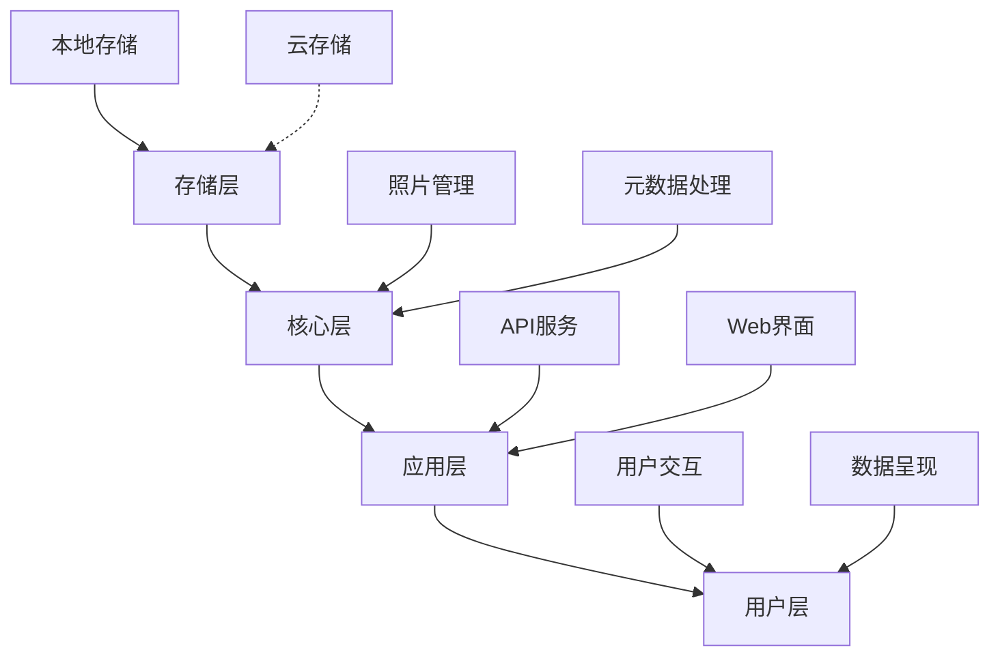

# 智能照片管理系统实施指南

## 一、系统原则

### 1.1 设计理念
基于第一性原则的照片管理系统，专注于解决以下核心问题：
- 照片的安全存储和可靠访问
- 照片信息的高效组织和检索
- 照片价值的挖掘和利用

### 1.2 系统架构


## 二、实施路线

### 2.1 第一阶段：基础功能实现（2-3周）

#### 2.1.1 存储系统
```
Storage/
├── Local/
│   ├── Photos/
│   │   ├── Original/
│   │   └── Processed/
│   └── Metadata/
└── Cache/
```

#### 2.1.2 元数据管理
- 基本信息：文件名、大小、创建时间
- EXIF数据：拍摄参数、时间、位置
- 自定义标签：用户标注、分类信息

#### 2.1.3 核心功能
- 照片导入和组织
- 基本检索功能
- 标签管理系统

### 2.2 第二阶段：功能增强（3-4周）

#### 2.2.1 智能分析
```python
class PhotoAnalyzer:
    def __init__(self):
        self.metadata_extractor = MetadataExtractor()
        self.content_analyzer = ContentAnalyzer()
    
    async def analyze(self, photo_path: str) -> Dict[str, Any]:
        metadata = await self.metadata_extractor.extract(photo_path)
        content_info = await self.content_analyzer.analyze(photo_path)
        return {
            'metadata': metadata,
            'content': content_info,
            'suggestions': self._generate_suggestions(metadata, content_info)
        }
```

#### 2.2.2 高级功能
- 内容识别
- 智能分类
- 高级搜索

### 2.3 第三阶段：系统优化（2-3周）

#### 2.3.1 性能优化
- 缓存策略
- 批量处理
- 异步操作

#### 2.3.2 用户体验
- 界面优化
- 操作流程简化
- 响应速度提升

## 三、技术规范

### 3.1 代码规范
```python
# 示例：存储接口定义
from abc import ABC, abstractmethod
from typing import List, Dict, Any

class StorageProvider(ABC):
    @abstractmethod
    async def save(self, file_path: str, metadata: Dict[str, Any]) -> str:
        """保存文件到存储系统"""
        pass
    
    @abstractmethod
    async def get(self, file_id: str) -> bytes:
        """从存储系统获取文件"""
        pass
    
    @abstractmethod
    async def list(self, prefix: str = "") -> List[Dict[str, Any]]:
        """列出存储系统中的文件"""
        pass
```

### 3.2 数据库设计
```sql
-- 照片基础信息
CREATE TABLE photos (
    id INTEGER PRIMARY KEY AUTOINCREMENT,
    file_path TEXT NOT NULL,
    file_name TEXT NOT NULL,
    file_size INTEGER,
    created_at TIMESTAMP DEFAULT CURRENT_TIMESTAMP,
    updated_at TIMESTAMP DEFAULT CURRENT_TIMESTAMP
);

-- 照片元数据
CREATE TABLE metadata (
    photo_id INTEGER PRIMARY KEY,
    metadata_json TEXT NOT NULL,
    FOREIGN KEY (photo_id) REFERENCES photos(id)
);

-- 标签系统
CREATE TABLE tags (
    id INTEGER PRIMARY KEY AUTOINCREMENT,
    name TEXT NOT NULL UNIQUE
);

CREATE TABLE photo_tags (
    photo_id INTEGER,
    tag_id INTEGER,
    PRIMARY KEY (photo_id, tag_id),
    FOREIGN KEY (photo_id) REFERENCES photos(id),
    FOREIGN KEY (tag_id) REFERENCES tags(id)
);
```

## 四、部署指南

### 4.1 开发环境
```bash
# 环境设置
python -m venv venv
source venv/bin/activate  # Windows: venv\Scripts\activate
pip install -r requirements.txt

# 数据库初始化
python manage.py init_db

# 运行开发服务器
python manage.py runserver
```

### 4.2 生产环境
```bash
# 使用 Docker 部署
docker-compose up -d
```

## 五、维护指南

### 5.1 日常维护
- 数据库备份（每日）
- 存储空间检查（每周）
- 系统日志审查（每日）

### 5.2 性能监控
- 响应时间
- 资源使用
- 错误率统计

## 六、执行计划

### 6.1 基础设施完善（1周）

#### 6.1.1 CI/CD流程
- GitHub Actions/Jenkins pipeline配置
- 自动化测试流程
- 代码质量检查（pylint, black）
- 自动化部署流程

#### 6.1.2 监控系统
- Prometheus指标收集
  - 系统资源使用
  - API性能指标
  - 业务关键指标
- 告警配置
- 日志管理系统

#### 6.1.3 Docker优化
- 镜像精简
- 健康检查机制
- 资源限制配置
- 多阶段构建优化

### 6.2 核心功能开发（2周）

#### 6.2.1 OneDrive集成
- OAuth认证流程
- 文件同步机制
  - 增量同步
  - 冲突处理
  - 错误重试
- 元数据同步

#### 6.2.2 照片管理功能
- 元数据提取系统
- 索引构建
- 搜索功能实现
- 标签管理系统

#### 6.2.3 数据安全
- 备份策略实现
- 数据完整性验证
- 错误恢复流程
- 权限管理系统

### 6.3 性能优化（1周）

#### 6.3.1 缓存系统
- Redis缓存策略
- 多级缓存实现
- 预加载机制
- 缓存失效处理

#### 6.3.2 数据库优化
- 查询性能优化
- 索引优化
- 分页实现
- 连接池管理

### 6.4 用户体验（1周）

#### 6.4.1 错误处理
- 用户友好错误提示
- 自动恢复机制
- 错误追踪系统

#### 6.4.2 性能监控
- 性能指标收集
- 性能日志系统
- 性能基准测试

### 6.5 日常维护计划

#### 6.5.1 每日任务
- 代码审查
- 单元测试维护
- 文档更新
- 日志检查

#### 6.5.2 每周任务
- 性能检查
- 安全扫描
- 依赖更新
- 系统备份验证

#### 6.5.3 月度任务
- 系统全面审计
- 性能压力测试
- 用户反馈分析
- 文档完整性检查

### 6.6 风险管理

#### 6.6.1 技术风险
- OneDrive API限制应对策略
- 大文件处理方案
- 并发访问处理
- 网络异常处理

#### 6.6.2 运维风险
- 数据备份策略
- 系统可用性保障
- 资源使用监控
- 安全漏洞防范
